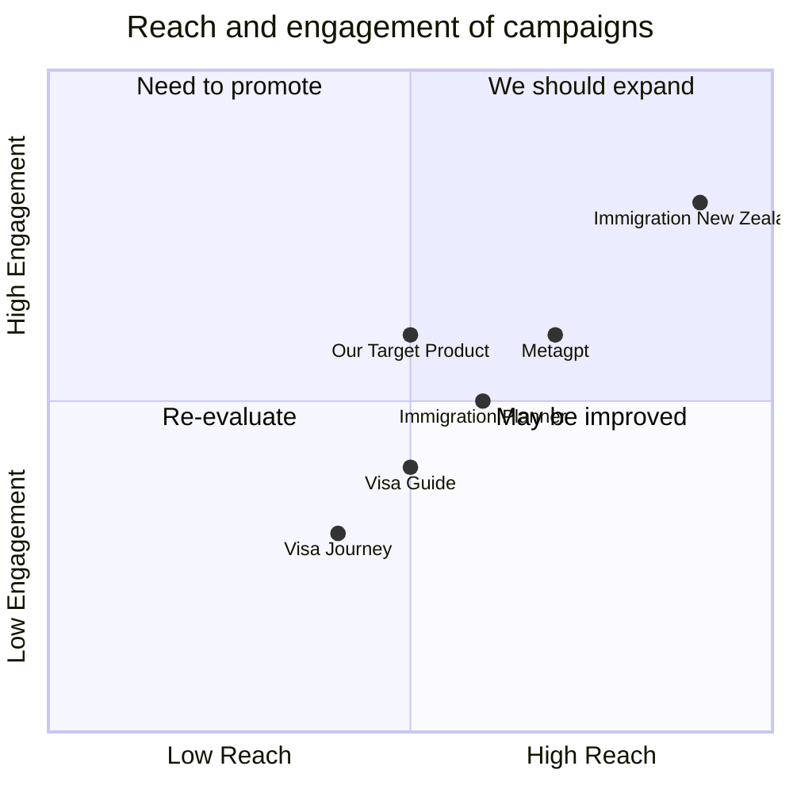

## Original Requirements
The boss wants an application similar to metagpt, which can generate New Zealand immigration reports based on information such as education, qualifications, and English levels provided by users.

## Product Goals
```python
[
    "Create an application that generates New Zealand immigration reports",
    "Ensure the application is user-friendly and easy to navigate",
    "Ensure the application provides accurate and reliable results"
]
```

## User Stories
```python
[
    "As a user, I want to input my education, qualifications, and English levels so that I can generate an immigration report",
    "As a user, I want to be able to easily navigate the application so that I can input my information without confusion",
    "As a user, I want to receive accurate and reliable results so that I can trust the information provided",
    "As a user, I want to be able to save and print my report so that I can reference it later",
    "As a user, I want to be able to update my information and regenerate the report so that it reflects my current situation"
]
```

## Competitive Analysis
```python
[
    "Metagpt: A language model that can generate text based on input. However, it does not specialize in immigration reports",
    "Immigration New Zealand: The official website provides accurate information but does not generate personalized reports",
    "Visa Guide: Provides visa information but does not generate reports",
    "Immigration Planner: Provides immigration planning tools but does not generate reports",
    "Visa Journey: Provides a community for immigration discussions but does not generate reports"
]
```

## Competitive Quadrant Chart


## Requirement Analysis
The product should be a user-friendly application that allows users to input their education, qualifications, and English levels to generate a New Zealand immigration report. The application should provide accurate and reliable results, and allow users to save, print, and update their reports.

## Requirement Pool
```python
[
    ("User can input education, qualifications, and English levels", "P0"),
    ("Application generates a New Zealand immigration report based on user input", "P0"),
    ("User can save and print the report", "P1"),
    ("User can update their information and regenerate the report", "P1"),
    ("Application provides accurate and reliable results", "P0")
]
```

## UI Design draft
The application should have a clean and simple design with intuitive navigation. The home page should have a form for users to input their information. Once the information is submitted, the application should generate a report that is displayed on a new page. This page should have options to save, print, and update the report.

## Anything UNCLEAR
There are no unclear points.