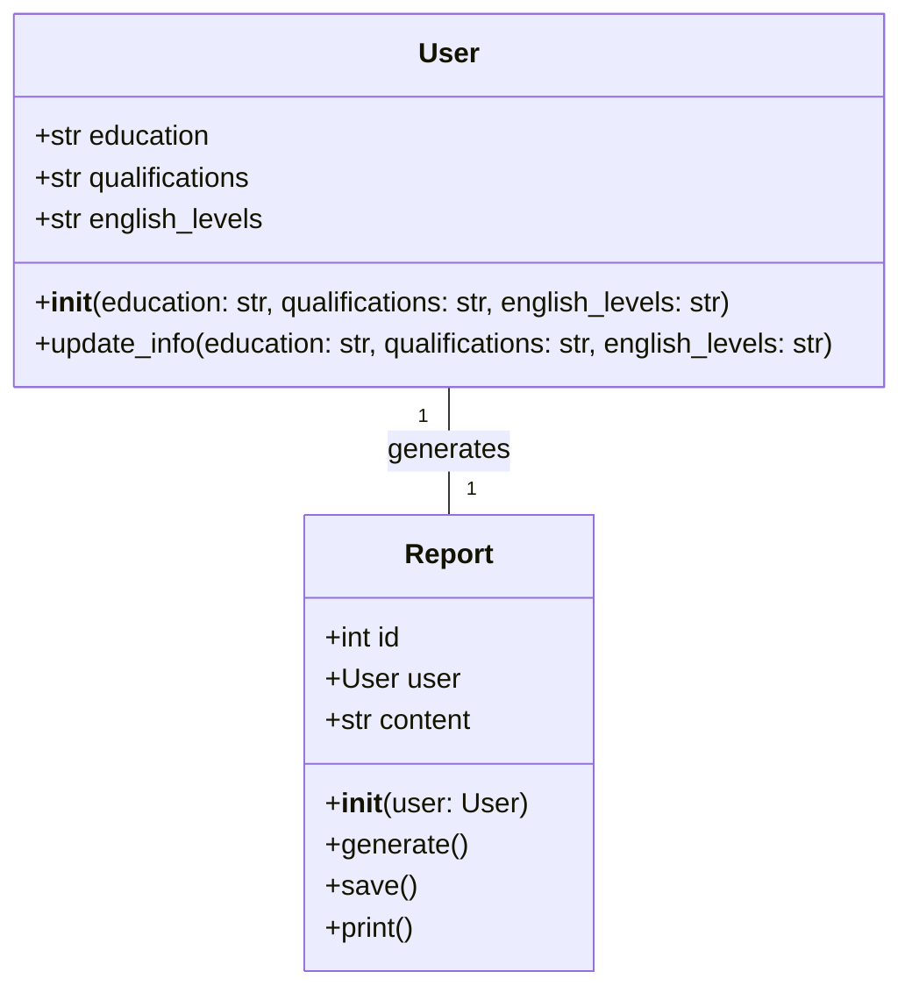
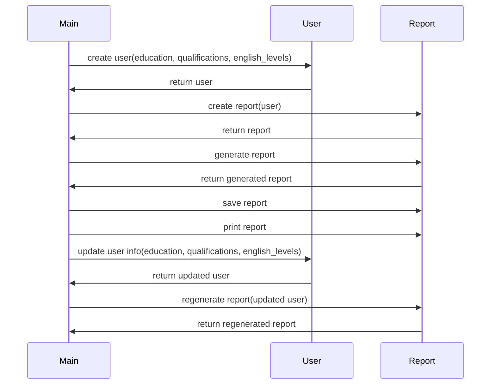

## Implementation approach
We will use Flask, a lightweight and flexible Python web framework, to build the application. The user interface will be built using HTML, CSS, and JavaScript. For data validation and processing, we will use Python's built-in libraries. We will use SQLite for data storage and SQLAlchemy as the ORM. For generating the report, we will use the ReportLab library. We will also use pytest for testing.

## Python package name
```python
"nz_immigration_report_generator"
```

## File list
```python
[
    "main.py",
    "config.py",
    "models.py",
    "forms.py",
    "views.py",
    "services.py",
    "tests.py",
    "templates/index.html",
    "templates/report.html",
    "static/styles.css",
    "static/scripts.js"
]
```

## Data structures and interface definitions


## Program call flow


## Anything UNCLEAR
The requirement is clear to me.